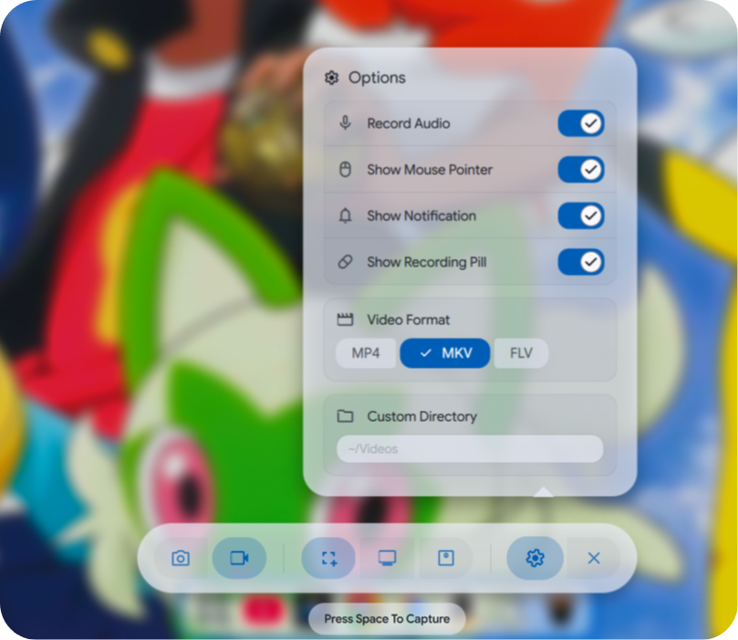
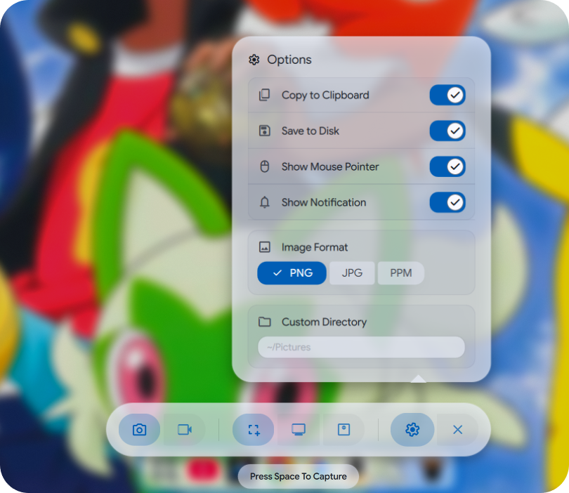
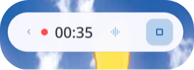
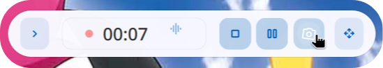
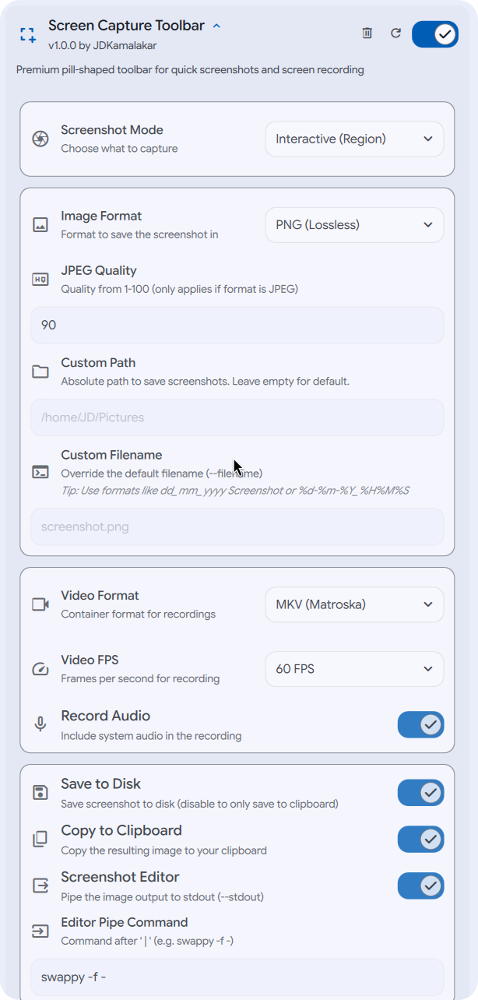

<div align="center">

<a href="https://github.com/JDKamalakar/DMS-ScreenCapture_Toolbar">
    
</a>

# [DMS-ScreenCapture_Toolbar](#)

### Premium Screen Capture Management
A high-end, glassmorphic floating pill toolbar for the Dank Material Shell. Seamlessly switch between photo and video modes with tactile animations and dynamic, mode-aware controls.

[](https://github.com/Dank-Material-Shell)
[](https://github.com/DankMaterialShell)
[](https://github.com/JDKamalakar/DMS-ScreenCapture_Toolbar/graphs/commit-activity)

## Download

[](https://danklinux.com/plugins)

*Requires Dank Material Shell (DMS) 1.0 or higher.*

## Requirements

To use **Interactive Mode** in screen recorder mode, you must have `slurp` installed on your system.

<div align="left">

```bash
# Debian/Ubuntu
sudo apt install slurp
```
```bash
# Fedora
sudo dnf install slurp
```

</div>

## Features

<div align="left">


* **Premium Glassmorphism**: Translucent, theme-aware "Floating Pill" design that respects system light and dark modes with 0.98 opacity surfaces.
* **Repositionable UI**: "Click-to-Move" logic with pixel-perfect absolute coordinate tracking, allowing you to place the recording pill anywhere on your workspace.
* **Adaptive Theme Support**: Intelligent UI that dynamically flips icon and text colors between black and white based on your theme brightness for guaranteed visibility.
* **Smart Recording Pill**: A collapsible, high-frequency overlay that displays live recording duration and provides instant access to stop, pause, and screenshot actions.
* **Tactile Interaction**: Features playful 360° spins, tilt-and-jump micro-animations, and responsive Dank Ripples on every interactive element.
* **Dynamic Settings**: A context-aware popup bubble that automatically filters capture settings (FPS, Audio, Formats) based on your active mode (Photo vs. Video).
* **Versatile Capture**: Native support for interactive region selection, active monitor focus, and full-workspace grabbing.
* **Power Workflow**: Lightning-fast controls with `Spacebar` to trigger captures and `Escape` for instant dismissal.

</div>

## Interface

<div align="center">
    
    
</div>
<br>
<div align="center">
    
    
</div>

## Configuration

<div align="center">
    
</div>

## Contributing

Pull requests are welcome. For major changes, please open an issue first to discuss what you would like to change.

Before reporting a new issue, take a look at the [FAQ](https://github.com/JDKamalakar/DMS-ScreenCapture_Toolbar/wiki), the [changelog](https://github.com/JDKamalakar/DMS-ScreenCapture_Toolbar/releases) and the already opened [issues](https://github.com/JDKamalakar/DMS-ScreenCapture_Toolbar/issues).

### Credits

Built with ❤️ for the [Dank Material Shell](https://github.com/DankMaterialShell) community.

<a href="https://github.com/JDKamalakar/DMS-ScreenCapture_Toolbar/graphs/contributors">
    
</a>

### Disclaimer

This application is an independent utility for Dank Material Shell.

### 📜 License

Part of DankMaterialShell. Check the main repository for license information.

</div>
